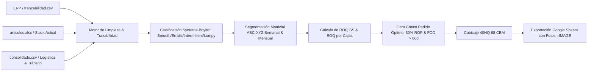
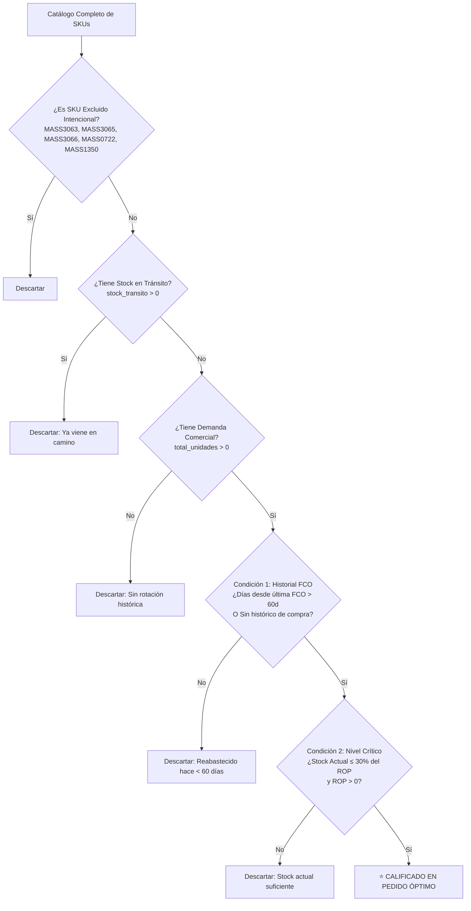

# Sistema de Planificación de Inventarios, Pronóstico de Demanda y Optimización de Contenedores
## Manual Técnico, Matemático y Operativo (Masshopping Supply Chain v3.0)

---

## 1. Resumen Ejecutivo y Propósito del Sistema

El **Sistema de Planificación de Inventarios y Optimización de Contenedores de Masshopping** es una plataforma analítica y de soporte a la toma de decisiones diseñada para la gestión integral de la cadena de suministro internacional (importaciones marítimas China / Egipto $\rightarrow$ Venezuela).

### Objetivo Principal
Resolver el dilema fundamental de la gestión de inventarios: **minimizar las roturas de stock (quiebres) de productos de alta rotación mientras se evita el sobrestock de capital inmovilizado**, sincronizando las órdenes de compra con la capacidad volumétrica de contenedores marítimos de 40 pies High Cube (40HQ, 68 CBM).



---

## 2. Fuentes de Datos y Modelo de Trazabilidad Comercial

El sistema opera bajo el principio de **Fuente Única de Verdad Histórica**, integrando archivos de diversas áreas de la empresa:

```
data/
├── ventas.csv          # Historial de ventas, ingresos reales y facturación FVE (Fuente Única de Demanda y ABC)
├── tranzabilidad.csv   # Movimientos de inventario ERP (Utilizado estrictamente para Compras FCO y Devoluciones DEC)
├── articulos.xlsx      # Catálogo maestro y existencias actuales en almacén
├── consolidado.csv     # Metadata logística (CBM, dimensiones, empaque, costos FOB, tránsito)
├── images.csv          # Catálogo de enlaces CDN de fotografías de producto
└── p2p.json            # Serie temporal cambiaria USDT/VES (Binance P2P)
```

### 2.1. Reglas de Negocio para Transacciones y Análisis ABC

1. **Ventas y Análisis ABC (`ventas.csv` + `ventas_i.csv`):**
   - El análisis de demanda comercial, series temporales, ADI, CV y la clasificación **Pareto ABC** se alimenta **exclusivamente de `ventas.csv`** (y cualquier partición incremental `ventas_1.csv`, `ventas_2.csv`, etc.).
   - Utiliza montos de facturación reales en dólares (`Total`, `Total Costo`, `Costo Unitario`) evitando cualquier distorsión en la valoración monetaria del inventario y las ventas.
   - **JAMÁS se utiliza `tranzabilidad.csv` para ventas ni para el cálculo ABC.**

2. **Historial de Compras y Reposición (`tranzabilidad.csv`):**
   - Si está presente, `tranzabilidad.csv` se utiliza de forma estricta y delimitada para extraer las compras a proveedores (`FCO`) y devoluciones (`DEC`), permitiendo calcular la fecha de última compra (`ultima_fecha_fco`) y la reposición neta histórica:

| Código | Tipo de Transacción | Rol en el Sistema | Tratamiento Matemático |
| :--- | :--- | :--- | :--- |
| **`FVE`** | Factura de Venta (`ventas.csv`) | Demanda Comercial (+) | Suma a la demanda real de clientes y facturación real ($). |
| **`FCO`** | Factura de Compra (`tranzabilidad.csv`) | Entrada de Reposición (+) | Suma al histórico de compras efectivas y última fecha FCO. |
| **`DEC`** | Devolución de Compra (`tranzabilidad.csv`) | Corrección de Compra (−) | Resta a compras netas recibidas. |

$$\text{Demanda Real y Facturación} = \sum \text{FVE de ventas.csv}$$
$$\text{Reposición Neta (Compras)} = \sum \text{FCO} - \sum \text{DEC de tranzabilidad.csv}$$

### 2.2. Robustez en el Procesamiento Numérico y Fechas
1. **Limpieza de Separadores de Miles:** El ERP exporta cantidades superiores a mil con formato texto (`"3,000.00"`). El sistema aplica `.astype(str).str.replace(',', '')` previo a la conversión a punto flotante para garantizar que pedidos mayores no se conviertan en cero.
2. **Corrección de Mojibake:** Limpieza automática de caracteres corruptos de codificación mixta (`UTF-8-SIG` / `Latin1`) para preservar la integridad de los nombres en reportes.
3. **Parseo Robusto de Fechas:** Compatibilidad con formatos mixtos (`DD/MM/YYYY hh:mm AM/PM` y `YYYY-MM-DD HH:MM:SS`).
4. **Fallback XML de Excel:** Si las definiciones de hojas de `articulos.xlsx` están corruptas, el sistema descomprime el `.xlsx` como archivo ZIP y parsea directamente el XML (`sharedStrings.xml` y `sheet1.xml`).

---

## 3. Fundamentos Matemáticos y Algorítmicos

### 3.1. Clasificación de Patrones de Demanda (Syntetos-Boylan)

La demanda en retail y comercio mayorista no es constante. Para seleccionar el modelo de pronóstico adecuado, el sistema categoriza cada SKU según dos dimensiones estadísticas:

1. **Intervalo Promedio entre Demandas ($ADI$ - Average Demand Interval):**
   $$ADI = \frac{N_{\text{períodos totales}}}{N_{\text{períodos con demanda positiva}}}$$
   *Mide la intermitencia o frecuencia de los pedidos.*

2. **Coeficiente de Variación Cuadrático ($CV^2$):**
   $$CV^2 = \left( \frac{\sigma_{\text{positivos}}}{\mu_{\text{positivos}}} \right)^2$$
   *Mide la volatilidad en el tamaño de las órdenes cuando ocurren.*

```
                 CV² (Variabilidad de Tamaño)
                 0                      0.49
           ┌──────────────────────┬──────────────────────┐
           │        SMOOTH        │       ERRATIC        │
         0 │ (Demanda Constante y │ (Demanda Frecuente   │
           │  Tamaño Regular)     │  pero Muy Variable)  │
ADI        ├──────────────────────┼──────────────────────┤
(Frecuencia│     INTERMITTENT     │        LUMPY         │
 de Venta) │ (Demanda Esporádica  │ (Demanda Esporádica  │
      1.32 │  pero Tamaño Regular)│  y Grandes Picos)    │
           └──────────────────────┴──────────────────────┘
```

* **Smooth ($ADI < 1.32, CV^2 < 0.49$):** Pronóstico estándar con promedio ponderado o EWMA.
* **Erratic ($ADI < 1.32, CV^2 \ge 0.49$):** Requiere colchón de variabilidad sin distorsionar la media.
* **Intermittent ($ADI \ge 1.32, CV^2 < 0.49$):** Se aplica la corrección **SBA (Syntetos-Boylan Approximation)** para evitar sobreestimar la tasa de demanda:
  $$\mu_{SBA} = \mu_{\text{incondicional}} \times \left(1 - \frac{CV^2}{2}\right)$$
* **Lumpy ($ADI \ge 1.32, CV^2 \ge 0.49$):** Demanda altamente irregular. El stock de seguridad se estima mediante percentiles no paramétricos de errores acumulados sobre el tiempo de entrega.

---

### 3.2. Tratamiento de Outliers (Winsorización al Percentil 95)

Para evitar que una venta mayorista atípica infle desproporcionadamente las sugerencias de compra para los meses siguientes, las series históricas de demanda se someten a **Winsorización**:

$$\hat{D}_t = \min\left( D_t, \; P_{95}(D_{\text{positivos}}) \right)$$

---

### 3.3. Segmentación Matricial ABC-XYZ

Cada SKU se clasifica en una matriz de 12 cuadrantes para priorizar la asignación de capital:

```
               X (CV ≤ 0.5)      Y (0.5 < CV ≤ 1.0)       Z (CV > 1.0)
         ┌─────────────────────┬─────────────────────┬─────────────────────┐
 AA (50%)│  Nivel Serv: 98%    │  Nivel Serv: 97%    │  Nivel Serv: 95%    │
  A (30%)│  Nivel Serv: 95%    │  Nivel Serv: 93%    │  Nivel Serv: 90%    │
  B (15%)│  Nivel Serv: 90%    │  Nivel Serv: 88%    │  Nivel Serv: 85%    │
  C  (5%)│  Nivel Serv: 85%    │  Nivel Serv: 80%    │  Nivel Serv: 75%    │
         └─────────────────────┴─────────────────────┴─────────────────────┘
```

1. **Clasificación ABC (Facturación Acumulada):**
   * **Clase AA:** Productos estrella que generan el primer $50\%$ de la facturación.
   * **Clase A:** Productos que acumulan del $50\%$ al $80\%$.
   * **Clase B:** Productos secundarios que acumulan del $80\%$ al $95\%$.
   * **Clase C:** Cola larga de productos que representan el último $5\%$ de la venta.

2. **Clasificación XYZ (Predecibilidad / Variabilidad):**
   * **Clase X ($CV \le 0.50$):** Demanda muy estable y predecible.
   * **Clase Y ($0.50 < CV \le 1.00$):** Demanda moderadamente variable.
   * **Clase Z ($CV > 1.00$):** Demanda errática o de difícil predicción.

---

### 3.4. Cálculo del Punto de Reorden ($ROP$) y Stock de Seguridad ($SS$)

El Punto de Reorden indica el nivel de existencias en el cual se debe disparar una orden de reabastecimiento:

$$ROP = \text{Demanda Esperada en Lead Time} + \text{Stock de Seguridad}$$

1. **Demanda Esperada en Lead Time ($DDLT$):**
   $$DDLT = \mu_{\text{tasa}} \times LT$$
   * Donde $LT = 15\text{ semanas}$ en el modelo semanal, o $LT = 3.5\text{ meses}$ en el modelo mensual.

2. **Stock de Seguridad ($SS$):**
   * Para cuadrantes **Smooth / Erratic**:
     $$SS = Z_{\alpha} \times \sigma_{\text{demanda}} \times \sqrt{LT} \times \text{Factor}_{SS}$$
     Donde $Z_{\alpha} = \Phi^{-1}(\text{Nivel de Servicio})$.
   * Para cuadrantes **Intermittent / Lumpy**:
     $$SS = \max\left(0, \; P_{90}\left( \text{RollingSum}_{LT}(D) - DDLT \right)\right) \times \text{Factor}_{SS}$$

> [!TIP]
> **Configuración del Factor de Stock de Seguridad:**
> El sistema permite ajustar el factor de seguridad entre $0\%$ y $100\%$ desde la barra lateral. Por defecto se establece en **$0\%$** para evitar sobreinventariar productos de lento movimiento, asegurando que el ROP cubra con exactitud la demanda proyectada del tiempo de entrega.

---

### 3.5. Lote Económico de Compra ($EOQ$) y Empaque Logístico

Para determinar la cantidad a ordenar:

$$EOQ = \sqrt{ \frac{2 \cdot D_{\text{anual}} \cdot S}{H} }$$

* $D_{\text{anual}} = \mu_{\text{semanal}} \times 52$ (o $\mu_{\text{mensual}} \times 12$).
* $S = \text{Costo Administrativo por Orden de Compra (USD)}$ (def: $\$50$).
* $H = \text{Costo Puesto Unitario (DDP)} \times \text{Tasa Anual de Mantenimiento de Inventario}$ (def: $15\%$).
* $\text{Costo Puesto (DDP)} = \text{Costo FOB} + (\text{CBM Unitario} \times \text{Flete por CBM})$.

**Ajuste a Cajas Cerradas:**
El pedido no se realiza en unidades sueltas sino en bultos / cajas completas:

$$\text{Cajas Sugeridas} = \left\lceil \frac{EOQ}{\text{Cantidad por Caja}} \right\rceil$$

---

## 4. El Algoritmo del Pedido Óptimo (TAB 7)

El **Generador de Pedido Óptimo** es el módulo de abastecimiento de emergencia y reorden prioritario. Filtra automáticamente el universo de más de 3,000 SKUs y extrae exclusivamente aquellos que cumplen las siguientes **dos condiciones obligatorias**:



### 4.1. Explicación de las Condiciones de Calificación

1. **Condición 1 (Filtro de Reposición Reciente):**
   * $\text{Días transcurridos desde última } FCO > 60\text{ días}$ **O** `"Sin histórico de compra"`.
   * **Objetivo:** Evitar duplicar órdenes de productos que ya fueron comprados en los últimos dos meses.

2. **Condición 2 (Umbral Crítico de Stock al 30% del ROP):**
   * $\text{Stock Actual} \le \text{ROP} \times 0.30$.
   * **Objetivo:** No pedir productos que están al $80\%$ o $90\%$ del ROP si aún tienen inventario para operar; priorizar únicamente aquellos en rotura o en riesgo severo de quiebre inmediato.

3. **Exclusiones Intencionales Documentadas:**
   * `MASS3063`, `MASS3065`, `MASS3066`: Barajitas del Mundial (productos de catálogo estacional agotados).
   * `MASS0722`: Bolsas plásticas de consumo interno cargadas con SKU comercial en el ERP.
   * `MASS1350`, `MASS1575`: Servicios / artículos descatalogados.

---

## 5. Estructura y Uso Operativo de las Pestañas de la Aplicación

La aplicación se organiza en 8 pestañas interconectadas:

```
[TAB 1] Armado de Contenedor (40HQ 68 CBM)
[TAB 2] Matriz ABC-XYZ (Conteo y % Reorden Semanal y Mensual)
[TAB 3] Ficha Técnica & Comparador (Evolución Demanda, P2P y Reposición Neta)
[TAB 4] Totalización por Categoría
[TAB 5] Plan de Compras Anual
[TAB 6] Comparación Semanal vs Mensual
[TAB 7] Generador de Pedido Óptimo (Abastecimiento Crítico + Google Sheets)
[TAB 8] Sobre Stock y Stock Inactivo (Dead Stock > 6 meses)
```

### Guía Operativa Paso a Paso:

#### A. Armar un Contenedor Manual / Personalizado (TAB 1)
1. Ingrese a **TAB 1**.
2. Filtre por categoría o busque productos específicos por SKU/nombre.
3. Marque los checkboxes en la columna `Incluir` o ajuste manualmente la columna `Cajas a Pedir`.
4. Observe en los indicadores superiores cómo se completan los **68 CBM del contenedor 40HQ** y la inversión FOB/DDP requerida.
5. Al alcanzar el $100\%$ de cubicaje, presione **"🚢 Asignar Contenedor y Cargar a Google Sheets"**.

#### B. Generar el Pedido Óptimo Automatizado (TAB 7)
1. Ingrese a **TAB 7**.
2. Seleccione el modelo deseado (por defecto: **🗓️ ROP Mensual 3.5 meses**).
3. El sistema listará automáticamente los SKUs que cumplen las condiciones críticas.
4. Revise las columnas: `Stock Actual`, `Última Compra (FCO)`, `ROP`, `Umbral Crítico (30%)`, `Cajas Sugeridas` y `Costo FOB`.
5. Descargue el pedido en CSV o envíelo directamente a Google Sheets.

#### C. Diagnosticar un Producto Individual (TAB 3)
1. Ingrese a **TAB 3**.
2. Seleccione el SKU en el buscador multiselect.
3. Analice las tarjetas KPI: Stock Actual, Tránsito, ROP Semanal/Mensual, Umbral 30%, Demanda Promedio y Fecha de Última Compra.
4. Revise el gráfico superior: Demanda semanal histórica vs línea de tendencia vs variación cambiaria USDT (Binance P2P).
5. Active el checkbox **"Mostrar Reposición (FCO - DEC)"** para visualizar el gráfico azul de compras históricas y verificar la sincronización entre ventas y abastecimiento.

---

## 6. Ventajas y Fortalezas del Modelo

1. **Precisión Matemática sin Distorsión:** Uso del método Syntetos-Boylan con corrección SBA y Winsorización, evitando que picos esporádicos sobredimensionen los pedidos.
2. **Control de Capital de Trabajo:** La regla del $30\%$ del ROP y la exclusión de compras $< 60\text{ días}$ elimina compras redundantes.
3. **Sincronización Logística Real:** Todos los pedidos se redondean a cajas cerradas y se calculan en CBM para llenar contenedores exactos de 68 CBM.
4. **Visibilidad Multidimensional:** Integración simultánea de demanda histórica, oferta/compras previas, inventario en tránsito y tipo de cambio (USDT).
5. **Interoperabilidad Eficiente:** Exportación directa a Google Sheets con renderizado de imágenes mediante `=IMAGE("url")` para facilitar la gestión con compras y proveedores en China.

---

## 7. Desventajas, Alcance y Limitaciones

### Desventajas / Trade-offs:
* **Dependencia de la Nomenclatura del ERP:** Si un producto cambia de código SKU o se crea un código duplicado para el mismo artículo físico, el sistema los analiza como dos productos independientes a menos que se unifiquen en el catálogo maestro.
* **Lead Time Constante Asumido:** El cálculo asume un tiempo de entrega estable (ej. 15 semanas / 3.5 meses). Ante contingencias extraordinarias de flete marítimo (crisis de rutas o congestión portuaria), se debe ajustar el slider de Lead Time en la barra lateral.

### Alcance:
* Cobertura completa del catálogo activo de Masshopping (> 3,000 SKUs).
* Modelación simultánea bajo granularidad semanal y mensual.
* Proyección de flujos de inventario, detección de quiebres y cubicaje.

### Limitaciones Actuales:
1. **Actualización por Lotes:** La ingesta de datos depende de la actualización periódica de los archivos fuente (`data/tranzabilidad.csv`, `articulos.xlsx`, `consolidado.csv`).
2. **Productos Nuevos Sin Histórico:** Un producto recién introducido no posee transacciones históricas (`FVE`/`FCO`). El sistema lo etiqueta como `"Sin histórico de compra"` y dependerá de las existencias actuales y del ROP inicial parametrizado.
3. **No Optimiza Precios:** El sistema optimiza el reabastecimiento físico y logístico, pero no modela elasticidad de precio de venta al público.

---

## 8. Glosario de Métricas y Parámetros

| Métrica / Término | Definición y Unidad | Fórmula / Criterio |
| :--- | :--- | :--- |
| **SKU** | Stock Keeping Unit | Código identificador único del producto. |
| **FOB** | Free On Board ($) | Costo de adquisición de la mercancía en el puerto de origen. |
| **DDP / Costo Puesto** | Delivered Duty Paid ($) | Costo FOB + Flete unitario por CBM prorrateado. |
| **CBM / CBMM** | Cubic Meter ($m^3$) | Volumen métrico de una caja cerrada del producto. |
| **ADI** | Average Demand Interval | Promedio de períodos entre semanas/meses con ventas. |
| **$CV^2$** | Coeficiente de Variación al Cuadrado | $(\sigma / \mu)^2$ de las cantidades vendidas. |
| **ROP** | Reorder Point (Punto de Reorden) | Nivel mínimo de stock para disparar una orden de compra. |
| **Umbral Crítico (30%)** | Nivel de urgencia extrema | $\text{ROP} \times 0.30$. Disparador del Pedido Óptimo. |
| **EOQ** | Economic Order Quantity | Tamaño de lote óptimo que minimiza costos de ordenar y mantener. |
| **FCO** | Factura de Compra | Movimiento de entrada por compra internacional o local. |
| **DEC** | Devolución de Compra | Movimiento de anulación o ajuste de compra. |
| **FVE** | Factura de Venta | Venta a cliente final o mayorista. |
| **NCV** | Nota de Crédito Venta | Devolución o ajuste de venta. |
